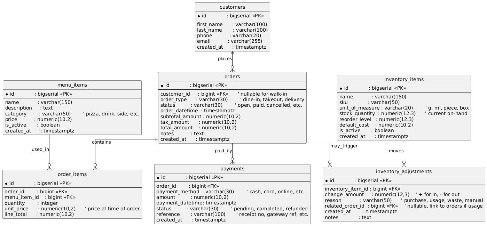

# PizzaOS API Documentation

## Overview
PizzaOS is an Express.js API written in TypeScript that uses TypeORM to persist data to PostgreSQL. It follows a layered structure with DTO validation middleware, controller and service layers, and TypeORM entities mapping to relational tables.

## Installation & Setup
1. **Prerequisites**
   - Node.js (v18+ recommended)
   - PostgreSQL instance and credentials
   - Yarn or npm
2. **Environment variables** (create `.env` in `api/` or project root)
   - `DB_HOST`, `DB_PORT`, `DB_USER`, `DB_PASSWORD`, `DB_NAME`
   - Optional: `PORT` for the HTTP server (defaults to `3000`).
3. **Install dependencies**
   ```bash
   cd api
   npm install
   ```
4. **Database preparation**
   - Create the target database in PostgreSQL.
   - Ensure the connection values in `.env` match the new database.
   - `synchronize` is disabled; run your own migrations or enable it during development if needed.
5. **Run the server**
   ```bash
   npm start
   ```
   The API starts on `http://localhost:3000` and mounts routes under `/api/v1`. A simple health check is available at `/api/test`.

## Architecture
- **Entities (TypeORM)**: Map tables to classes (`Customer`, `Order`, `Payment`, `OrderItem`, `MenuItem`, `InventoryItem`, `InventoryAdjustment`).
- **DTOs (class-validator)**: Input shapes with declarative validation for each resource (e.g., `CustomerDTO`, `OrderDTO`).
- **Middleware**: `validateDto` coerces and validates request bodies using `class-transformer` and `class-validator`, rejecting unknown fields and formatting errors.
- **Controllers**: Translate HTTP requests to service calls and handle responses/errors per resource.
- **Services**: Business logic and repository access for each entity.
- **Routes**: `src/routes/Routes.ts` maps REST endpoints to controllers and attaches DTO validation middleware.
- **Server bootstrap**: `src/server.ts` configures Express (morgan logging, JSON body parsing), initializes the TypeORM DataSource, registers routes, and starts the listener.

## Database Schema (entities)

- **customers** (`Customer`)
  - `id` PK, `first_name`, `last_name`, optional `phone`, unique optional `email`, `created_at` timestamp.
  - Relations: one-to-many `orders`.
- **orders** (`Order`)
  - `id` PK, optional FK `customer_id`, `order_type` (dine-in/takeout/delivery), `status`, `order_datetime`, monetary columns (`subtotal_amount`, `tax_amount`, `total_amount`), optional `notes`, `created_at`.
  - Relations: many-to-one `customer`, one-to-many `items` (`OrderItem`), `payments`, and `inventory_adjustments`.
- **payments** (`Payment`)
  - `id` PK, FK `order_id`, `payment_method`, `amount`, `payment_datetime`, `status`, optional `reference`, `created_at`.
  - Relation: many-to-one `order` (cascade delete).
- **menu_items** (`MenuItem`)
  - `id` PK, `name`, optional `description`, `category`, `price`, `is_active`, `created_at`.
  - Relation: one-to-many `order_items`.
- **order_items** (`OrderItem`)
  - `id` PK, FKs `order_id` and `menu_item_id`, `quantity`, `unit_price`, `line_total`.
  - Relations: many-to-one `order` (cascade delete) and `menu_item`.
- **inventory_items** (`InventoryItem`)
  - `id` PK, `name`, optional unique `sku`, `unit_of_measure`, `stock_quantity`, `reorder_level`, optional `default_cost`, `is_active`, `created_at`.
  - Relation: one-to-many `adjustments`.
- **inventory_adjustments** (`InventoryAdjustment`)
  - `id` PK, FK `inventory_item_id`, `change_amount`, `reason`, optional FK `related_order_id`, `created_at`, optional `notes`.
  - Relations: many-to-one `inventory_item` (cascade delete) and optional `related_order`.

## Data Flow & Validation
1. A request hits `/api/v1/...` and is matched by the router.
2. If the route expects a body, `validateDto(<ResourceDTO>)` runs first to enforce type and format constraints and strips unknown fields.
3. The controller extracts params/body, calls the corresponding service.
4. Services use repositories from the shared `AppDataSource` to query or persist entities.
5. Controllers serialize the result or return HTTP errors (404 for missing records, 400 on validation, 500 on unexpected errors).

## Routes & Endpoints
All endpoints are prefixed with `/api/v1`.
- **Customers**
  - `GET /customer` — list customers
  - `GET /customer/:id` — retrieve customer by id
  - `POST /customer` — create customer (DTO validated)
  - `PUT /customer/:id` — update customer (DTO validated)
  - `DELETE /customer/:id` — remove customer
- **Orders**
  - `GET /order` — list orders
  - `GET /order/:id` — retrieve order
  - `GET /order/customer/:customer_id` — orders for a customer
  - `POST /order` — create order (DTO validated)
  - `PUT /order/:id` — update order (DTO validated)
  - `PUT /order/:id/status` — update status (DTO validated)
  - `DELETE /order/:id` — cancel/delete order
- **Payments**
  - `GET /payment` — list payments
  - `GET /payment/:id` — retrieve payment
  - `GET /payment/order/:order_id` — payments for an order
  - `GET /payment/status/:status` — payments filtered by status
  - `POST /payment` — create payment (DTO validated)
  - `PUT /payment/:id` — update payment (DTO validated)
  - `PATCH /payment/:id/status` — update payment status (DTO validated)
  - `DELETE /payment/:id` — delete payment
- **Menu items**
  - `GET /menuitem` — list menu items
  - `GET /menuitem/:id` — retrieve menu item
  - `GET /menuitem/category/:category` — filter by category
  - `POST /menuitem` — create menu item (DTO validated)
  - `PUT /menuitem/:id` — update menu item (DTO validated)
  - `DELETE /menuitem/:id` — delete menu item
- **Inventory items**
  - `GET /inventoryitem` — list inventory items
  - `GET /inventoryitem/:id` — retrieve inventory item
  - `GET /inventoryitem/sku/:sku` — lookup by SKU
  - `POST /inventoryitem` — create inventory item (DTO validated)
  - `PUT /inventoryitem/:id` — update inventory item (DTO validated)
  - `DELETE /inventoryitem/:id` — delete inventory item
- **Order items**
  - `GET /orderitem` — list order items
  - `GET /orderitem/:id` — retrieve order item
  - `GET /orderitem/order/:order_id` — items for an order
  - `GET /orderitem/menuitem/:menu_item_id` — items for a menu item
  - `POST /orderitem` — create order item (DTO validated)
  - `PUT /orderitem/:id` — update order item (DTO validated)
  - `DELETE /orderitem/:id` — delete order item
- **Inventory adjustments**
  - `GET /inventoryadjustment` — list adjustments
  - `GET /inventoryadjustment/:id` — retrieve adjustment
  - `GET /inventoryadjustment/inventoryitem/:inventory_item_id` — adjustments for an inventory item
  - `GET /inventoryadjustment/relatedorder/:related_order_id` — adjustments linked to an order
  - `POST /inventoryadjustment` — create adjustment (DTO validated)
  - `PUT /inventoryadjustment/:id` — update adjustment (DTO validated)
  - `DELETE /inventoryadjustment/:id` — delete adjustment

## DTO Validation Middleware
`validateDto` (in `src/middleware/ValidateDTO.ts`) transforms the body into a DTO class instance, runs `class-validator` rules, strips unknown fields, and returns 400 responses with per-field errors when validation fails. On success, the sanitized DTO instance replaces `req.body` before hitting controllers.

## Future Improvements / TODO
- [X] Secure the API with JWT-based authentication.
- [X] Add role-based access control for staff, managers, and admins.
- [] Ship a React frontend that consumes these endpoints.
- [] Add integration and unit tests for services, controllers, and DTO validation.
- [] Introduce automated migrations and seed scripts for development data.
- [] Add pagination, sorting, and filtering helpers for list endpoints.
- [] Provide OpenAPI/Swagger documentation and CI workflows.
